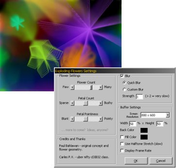



## Exploding Flowers Screensaver \(w/Blur\)

### Description

This is a modification of Paul Bahlawan's original Planet Source code post. My version adds a few extra things, most notably a reasonably fast (for VB, that is) blur effect.           It also includes the abililty to dynamically set the screen resolution and buffer size (for varying degrees of speed/smoothness) and the ability to render transparent flowers.     See the README.txt file for more information.
 
### More Info
 

             |
---                |---
**Submitted On**   |2004-04-18 15:05:58
**By**             |[redbird77](https://github.com/Planet-Source-Code/PSCIndex/blob/master/ByAuthor/redbird77.md)
**Level**          |Intermediate
**User Rating**    |5.0 (40 globes from 8 users)
**Compatibility**  |VB 4\.0 \(32\-bit\), VB 5\.0, VB 6\.0
**Category**       |[Graphics](https://github.com/Planet-Source-Code/PSCIndex/blob/master/ByCategory/graphics__1-46.md)
**World**          |[Visual Basic](https://github.com/Planet-Source-Code/PSCIndex/blob/master/ByWorld/visual-basic.md)
**Archive File**   |[Exploding\_1734904182004\.zip](https://github.com/Planet-Source-Code/redbird77-exploding-flowers-screensaver-w-blur__1-53241/archive/master.zip)

